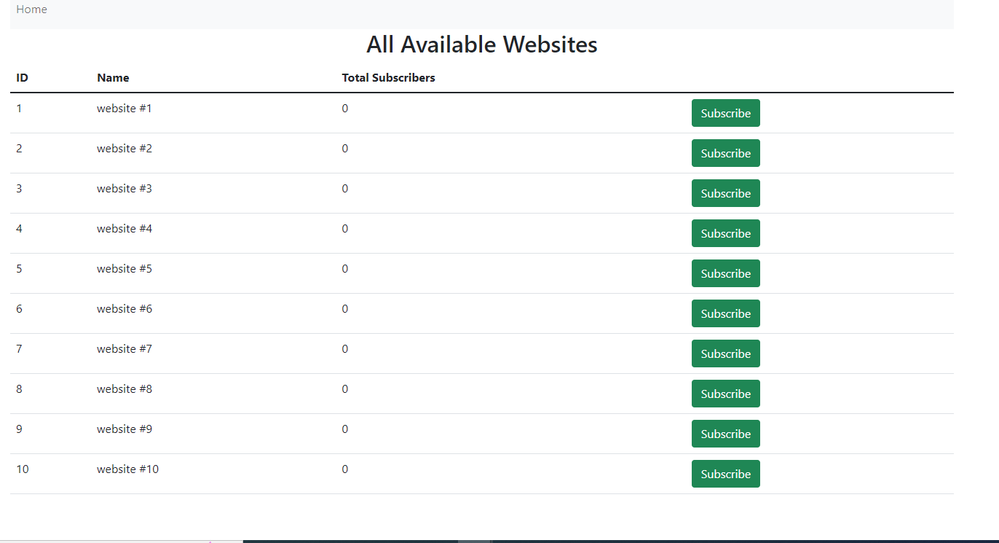

## About Project

A simple subscription platform (RESTful APIs with MySQL, Vue.js UI) in which users
can subscribe to one or more websites
Whenever a new post is published on a particular website, all its subscribers shall receive an
email with the post title and description in it. No authentication of any kind is required.

## Environment Setup

In project root directory create copy of .env.example file named it as .env
Then define APP_URL, MIX_API_URL, database, & smtp details with your local configuration.

## Database Setup
For setting up database tables run below command:
- php artisan migrate

This command will create dummy websites in website table.
- php artisan db:seed --class=WebsitesTableSeeder

## Laravel Setup

In project root dorectory run below command to install all laravel dependencies:
- composer install

## VueJs Setup

In project root dorectory run below command to install VueJs dependencies:
- npm install

## Rest API

- v1/website
    - get all records
        - GET v1/website
    - get single record 
        - GET v1/website/{id}
    - post request
        - POST v1/website
- v1/user
    - get all records
        - GET v1/user
    - get single record 
        - GET v1/user/{id}
    - post request
        - POST v1/user
- v1/posts
    - get all records
        - GET v1/posts
    - get single record 
        - GET v1/posts/{id}
    - post request
        - POST v1/posts
- v1/subscribe
    - get all records
        - GET v1/posts
    - get single record 
        - GET v1/posts/{id}
    - post request
        - POST v1/posts